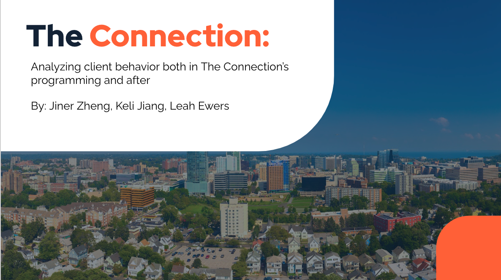

# A statistical analysis project for the Connection

## Description:

This is a statistical analysis research project on Analyzing Client Behavior in The Connection, sponsored by [the Connection Inc.](https://www.theconnectioninc.org/) and [Wesleyan Quantitative Analysis Center](https://www.wesleyan.edu/qac/). 

## Authors:

-   **Jiner Zheng** :baby_chick:**, Keli Jiang** :otter: **, Leah Ewers** :woman_cartwheeling:

-   **Faculty Advisor: Professor Jennifer Rose**

## Research Questions:

1.  Where do The Connection clients locate to after the programs and what are their characteristics?

2.  What social and psychological factors are associated with an increased likelihood of behavioral incidents during clients' participation in Connection programming?

## Useful Code Sources:

-   [first_report.Rmd](https://github.com/Cyanjiner/stat-consulting/blob/main/first_report.Rmd) contains code for data cleaning, data management, univariate analyses, & regression modeling.

-   [latent-class-analysis.Rmd](https://github.com/Cyanjiner/stat-consulting/blob/main/latent-class-analysis.Rmd) contains code for performing LCA on sub-sample.

-   [LCA-report&chi.Rmd](https://github.com/Cyanjiner/stat-consulting/blob/main/LCA-report&chi.Rmd) contains code for EDA of client class profiles and chi-square tests.

Note: you can also set up the environment using [stat-consulting.Rproj](https://github.com/Cyanjiner/stat-consulting/blob/main/stat-consulting.Rproj) in R.

## Output & Materials:

-   [#Team1-Presentation.pptx](https://github.com/Cyanjiner/stat-consulting/blob/main/%23Team1-Presentation.pptx) contains our presentation slides outlining our measures, analytical methods, findings, and recommendations.

-   [LCA-output.html](https://github.com/Cyanjiner/stat-consulting/blob/main/LCA-output.html) contains output of the Latent Class Analysis.

-   [LCA-report&chi.html](https://github.com/Cyanjiner/stat-consulting/blob/main/LCA-report-chi.html) contains exploratory analyses of client profiles and chi-square test results.

-   [client_class.csv](https://github.com/Cyanjiner/stat-consulting/blob/main/client_class.csv) contains data of complete client profiles with the latent class membership (on the sub-sample used in LCA).
